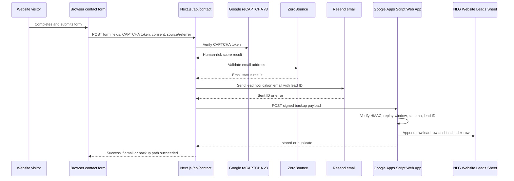

# Lead Intake Backup Architecture and SOP

Status: Active  
Owner: North Lantern Group  
Primary Google Workspace owner: hamza@northlanterngroup.com  
Backup Google Workspace/Vercel access: hello@northlanterngroup.com  
Last updated: 2026-04-26

## Purpose

North Lantern Group's website contact form already sends lead notifications
by email through Resend. Email alone is not a durable lead record: messages
can be missed, filtered, deleted, or become hard to audit later.

This architecture adds a second, company-owned backup record for every valid
contact form submission. The backup is intentionally simple: a restricted
Google Sheet receives one structured row per lead through a Google Apps Script
Web App. The public website browser never writes directly to Google Sheets.
Only the server-side Next.js contact route can create a valid signed request.

This gives the business:

- A readable lead register that non-technical operators can open in Google
  Sheets.
- A fallback record if Resend email delivery fails.
- A deduplicated lead ID that appears in both email and the Sheet.
- A low-maintenance setup using existing Google Workspace and Vercel accounts.
- No additional paid CRM or tracking subscription.

## Plain-English Summary

A visitor submits the website form. The website server checks spam protection,
validates the email, tries to send the lead email, then also sends a signed
backup copy to Google. Google Apps Script checks the signature and writes the
lead to the private Sheet. If the same lead is submitted twice with the same
lead ID, the Sheet does not get a duplicate row.

## What "Google Apps Script Web App" Means

Google Apps Script is Google's lightweight scripting layer for Google Workspace.
It can automate Sheets, Gmail, Drive, and related Workspace tools.

An Apps Script Web App is not a customer-facing app interface. In this setup it
is a private automation endpoint: a URL that accepts server-to-server POST
requests. The URL is public at the network layer because Google must be able to
receive the request, but it is not trusted by itself. A request is accepted only
when it includes a valid HMAC signature created by the website server using a
shared secret stored outside the repo.

## System Components

| Component | Purpose | Where it lives |
|-----------|---------|----------------|
| Public contact form | Collects visitor input, consent, CAPTCHA token, source page, and referrer | `src/components/sections/Contact.tsx` |
| Next.js contact API | Validates the submission, runs CAPTCHA/email checks, sends email, writes backup | `src/app/api/contact/route.ts` |
| Lead backup helper | Creates signed HMAC payloads and posts to Apps Script with timeout handling | `src/lib/leadBackup.ts` |
| Google Apps Script | Verifies signed requests, dedupes by lead ID, writes Sheet rows, logs events | `integrations/google-apps-script/lead-intake/Code.gs` |
| Google Sheet | Human-readable durable lead register | Google Workspace, owned by `hamza@` |
| Vercel env vars | Store runtime configuration and HMAC secret for the Next.js server | Vercel project under `hello@` |
| Apps Script properties | Store Sheet ID and matching HMAC secret for Apps Script | Apps Script project under `hamza@` |

## Data Flow

## Inputs

The form/API handles these visitor-provided fields:

- First name
- Last name
- Company
- Company size
- Email
- Phone
- Area of interest
- Message
- Optional marketing consent
- Required privacy acknowledgement

The API also handles operational metadata:

- Lead ID generated server-side
- Submission timestamp generated server-side
- Resend message ID when email succeeds
- Email failure reason when Resend fails
- Source page and referrer

Source page/referrer are sanitized server-side. Arbitrary query strings and URL
fragments are removed before backup. Only standard UTM attribution parameters
are preserved.

## Processing Rules

1. The API rejects missing required fields.
2. The API rejects submissions without privacy acknowledgement.
3. The honeypot field blocks basic automated spam.
4. reCAPTCHA v3 runs server-side verification.
5. ZeroBounce email validation blocks clearly invalid, spamtrap, and disposable
   addresses.
6. The API generates a unique lead ID.
7. Resend email is sent with the lead ID as the idempotency key.
8. The backup helper builds an exact JSON payload string and signs it with
   HMAC-SHA256.
9. Apps Script verifies the signature before trusting the payload.
10. Apps Script rejects expired signed payloads using a replay window.
11. Apps Script deduplicates by lead ID through the `Lead Index` sheet.
12. Apps Script writes accepted leads to `Raw Leads` and operational events to
    `Integration Events`.

## Outputs

### Email Output

The `leads@northlanterngroup.com` inbox receives the lead notification when
Resend succeeds. The email includes the lead ID so operators can match it to the
Google Sheet row.

### Sheet Output

The Google Sheet contains:

- `Raw Leads`: one row per accepted lead.
- `Lead Index`: dedupe/index data keyed by lead ID.
- `Integration Events`: storage, duplicate, rejection, and fallback-alert
  events.

### API Output

The browser receives a generic success response when at least one durable path
succeeds:

- Email succeeded, backup succeeded.
- Email succeeded, backup failed.
- Email failed, backup succeeded.

The browser receives an error only when both email and backup paths fail.

## Failure Behavior

| Condition | User sees | Operator impact |
|-----------|-----------|-----------------|
| Email succeeds, backup succeeds | Success | Normal state |
| Email succeeds, backup fails | Success | Email still contains lead; server logs backup error |
| Email fails, backup succeeds | Success | Sheet contains lead marked `email_status=failed`; Apps Script can send fallback alert |
| Email fails, backup fails | Error | No durable lead path succeeded; server logs error |
| Duplicate signed request | Success | Apps Script returns `duplicate`; no duplicate raw lead row |
| Invalid signature | Failed Apps Script response | No row is written |
| Expired signed request | Failed Apps Script response | No row is written |

## Security Controls

- The browser never receives the Apps Script HMAC secret.
- The real Apps Script deployment URL and HMAC secret are not committed to Git.
- Vercel stores the website-side environment variables.
- Apps Script stores the Google-side script properties.
- Requests are signed with HMAC-SHA256 over the exact JSON payload string.
- Signed payloads expire through a replay window.
- Apps Script uses `LockService` before writing rows to reduce concurrent write
  race conditions.
- Apps Script sanitizes values that begin with spreadsheet formula characters
  (`=`, `+`, `-`, `@`) to reduce spreadsheet formula injection risk.
- Lead source/referrer metadata strips arbitrary query strings and fragments.
- The Sheet is restricted to company-controlled accounts.

## Runtime Configuration

### Vercel Environment Variables

Set these in the Vercel project under `hello@northlanterngroup.com`.

| Variable | Value |
|----------|-------|
| `LEAD_BACKUP_ENABLED` | `true` in environments where backup should run |
| `LEAD_BACKUP_WEB_APP_URL` | Apps Script Web App deployment URL |
| `LEAD_BACKUP_HMAC_SECRET` | Long random shared secret; same value as Apps Script `HMAC_SECRET` |
| `LEAD_BACKUP_TIMEOUT_MS` | `4000` unless there is a measured reason to change it |

These variables should be marked sensitive.

### Apps Script Properties

Set these in Apps Script project settings.

| Property | Value |
|----------|-------|
| `SPREADSHEET_ID` | ID of the private NLG lead Sheet |
| `HMAC_SECRET` | Same value as Vercel `LEAD_BACKUP_HMAC_SECRET` |
| `ALERT_EMAIL` | `leads@northlanterngroup.com` |
| `RETENTION_MONTHS` | `24` |
| `REPLAY_WINDOW_SECONDS` | `600` |
| `RAW_SHEET_NAME` | `Raw Leads` unless changed intentionally |
| `INDEX_SHEET_NAME` | `Lead Index` unless changed intentionally |
| `EVENTS_SHEET_NAME` | `Integration Events` unless changed intentionally |

Never commit real secret values, real deployment URLs, or raw Sheet IDs unless
the repository has been explicitly approved for that internal data.

## Setup SOP

Use this only when rebuilding the integration or moving ownership.

1. Create or open the private Google Sheet under the chosen Workspace owner.
2. Name the Sheet `NLG Website Leads`.
3. Share the Sheet with the backup/admin account as editor.
4. Open Extensions -> Apps Script from that Sheet.
5. Replace the script contents with
   `integrations/google-apps-script/lead-intake/Code.gs`.
6. Save the Apps Script project.
7. Add the script properties listed above.
8. Run `setupLeadIntakeWorkbook()` once from Apps Script.
9. Complete Google's authorization flow as the Workspace owner.
10. Confirm the Sheet has `Raw Leads`, `Lead Index`, and `Integration Events`.
11. Deploy as a Web App:
    - Execute as: Me
    - Who has access: Anyone
12. Copy the Web App URL into Vercel as `LEAD_BACKUP_WEB_APP_URL`.
13. Generate a long random HMAC secret and set the same value in Vercel and Apps
    Script properties.
14. Set `LEAD_BACKUP_ENABLED=true` in Vercel.
15. Redeploy the Vercel site so the new env vars are visible to the runtime.
16. Run the validation checklist below.

## Validation Checklist

Before considering this integration healthy:

1. `npm run lint` passes.
2. `npm run build` passes.
3. A signed direct Apps Script smoke test returns `stored`.
4. Replaying the same signed payload returns `duplicate`.
5. An invalid signature returns `ok: false` and writes no raw lead row.
6. A real website form submission creates a lead email in `leads@`.
7. The same real submission creates a matching row in `Raw Leads`.
8. The lead ID in email matches the lead ID in the Sheet.
9. Vercel production deployment is complete after env changes.
10. The privacy policy still describes the actual vendors and data flow.

## HMAC Secret Rotation SOP

Rotate the secret if it is exposed, if a staff/admin account is compromised, or
as part of a scheduled security hygiene review.

1. Generate a new long random secret.
2. Update Apps Script `HMAC_SECRET`.
3. Update Vercel `LEAD_BACKUP_HMAC_SECRET`.
4. Redeploy the Vercel site.
5. Run the signed smoke test.
6. Confirm invalid signatures still fail.
7. Record the date and reason for rotation in the internal operations log.

During rotation, submissions may fail backup writes briefly if Vercel and Apps
Script are temporarily out of sync. Keep the rotation window short.

## Schema Change SOP

When changing form fields, lead status fields, or Sheet columns:

1. Update `LeadBackupInput` in `src/lib/leadBackup.ts`.
2. Update the `/api/contact` payload in `src/app/api/contact/route.ts`.
3. Update `RAW_HEADERS`, `INDEX_HEADERS`, and `buildRawRow_()` in
   `integrations/google-apps-script/lead-intake/Code.gs`.
4. Increment `BACKUP_SCHEMA_VERSION` and Apps Script `schemaVersion` handling
   only if the new Apps Script can no longer understand old payloads.
5. Update this SOP.
6. Update `docs/INFRASTRUCTURE.md`.
7. Update `docs/compliance/website-compliance-checklist.md` if personal data,
   vendors, retention, or legal disclosures changed.
8. Deploy a new Apps Script version.
9. Deploy the website.
10. Run the validation checklist.

## Daily/Weekly Operating SOP

For normal operations:

1. Monitor `leads@northlanterngroup.com` for new submissions.
2. Check the `Raw Leads` Sheet when a lead email seems missing or when doing
   weekly lead review.
3. Use `lead_status`, `owner`, `next_action`, and `notes` in the Sheet for light
   follow-up tracking until a dedicated CRM exists.
4. Treat the Sheet as a backup/lightweight intake register, not as a permanent
   full CRM.
5. Review rows older than the retention policy during quarterly privacy hygiene
   reviews.

## Incident SOP

If a lead reports a form issue or if operators suspect missing leads:

1. Check Vercel deployment status.
2. Check Vercel function logs for `/api/contact`.
3. Search `leads@northlanterngroup.com` by sender email, company, or lead ID.
4. Search the Google Sheet by lead ID, email, or company.
5. Review `Integration Events` for `rejected`, `stored`, `duplicate`, or
   `fallback_alert_failed` events.
6. If Apps Script rejects valid traffic, compare Vercel
   `LEAD_BACKUP_HMAC_SECRET` with Apps Script `HMAC_SECRET`.
7. If Resend fails but Sheet backup works, follow up manually from the Sheet and
   investigate Resend separately.
8. If both paths fail, disable `LEAD_BACKUP_ENABLED` only if the backup path is
   causing user-visible failures, then fix and redeploy.

## What Was Built on 2026-04-26

The following was implemented:

- Server-side backup helper with HMAC signing and timeout handling.
- Contact API changes to generate lead IDs, use Resend idempotency, enforce
  privacy acknowledgement server-side, and persist a backup lead record.
- Frontend contact form changes to send privacy acknowledgement, source page,
  and referrer metadata.
- Google Apps Script lead intake endpoint with HMAC verification, replay window,
  dedupe index, raw lead rows, event logs, fallback alert support, and formula
  injection hardening.
- Privacy policy updates to disclose the restricted Google Sheets backup and
  source/referrer metadata.
- Infrastructure and compliance documentation updates.
- Vercel environment variables for the backup integration.
- Live Apps Script smoke tests for stored, duplicate, and invalid-signature
  behavior.

## Current Known Limits

- This is a lightweight lead backup and operational register, not a full CRM.
- Google Apps Script quotas are sufficient for expected marketing-site volume,
  but it is not designed for high-volume event tracking.
- The Sheet is manually reviewed; there is no automated lead assignment workflow
  beyond the optional Sheet fields.
- Deleting or archiving old lead rows should follow the retention policy and be
  confirmed before bulk deletion.

## Future Improvements

Consider these only when the business need is clear:

- Add Vercel Web Analytics and Speed Insights with privacy policy updates.
- Add a `/thank-you` page for free pageview-based conversion tracking.
- Add a lightweight CRM later if lead volume or follow-up ownership outgrows the
  Sheet.
- Add a scheduled Apps Script retention review/report instead of manually
  scanning old rows.
- Add a second alert path if `fallback_alert_failed` events appear.
